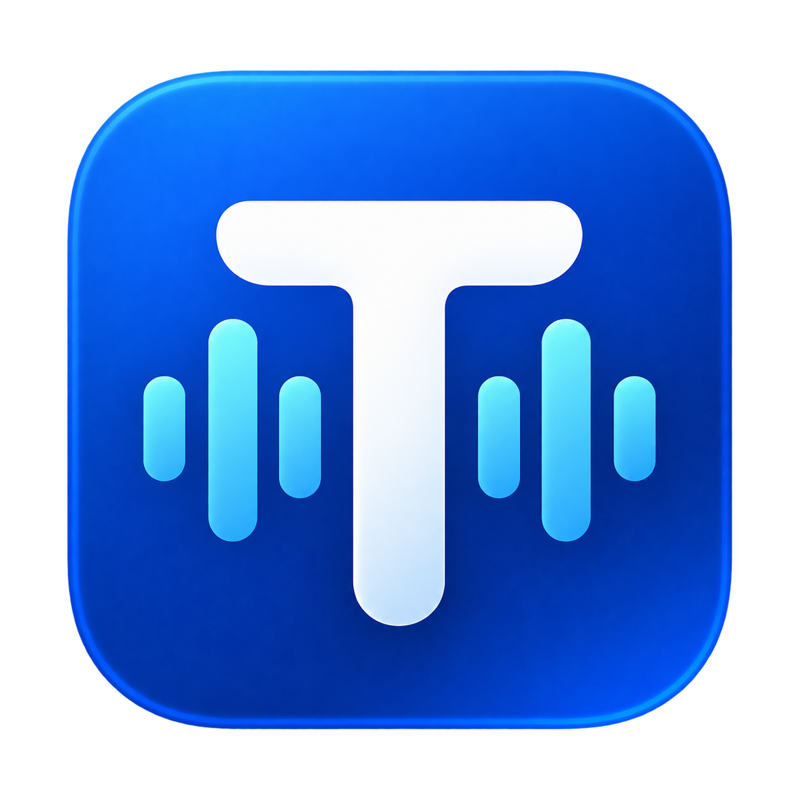
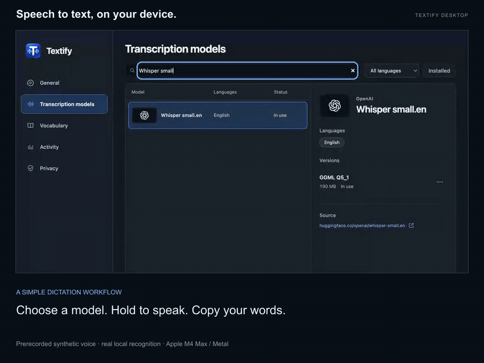

<p align="center">
  
</p>

<h1 align="center">Textify</h1>

<p align="center">
  <strong>Offline dictation for macOS, Windows, and Linux.</strong><br>
  Hold your shortcut, speak, and release. Turn speech into text on your own computer.
</p>

<p align="center">
  <a href="https://github.com/Player0109/Textify/releases/tag/v0.2.0-preview.23"></a>
  <a href="https://github.com/Player0109/Textify/actions/workflows/electron.yml"></a>
  <a href="LICENSE"></a>
</p>

<p align="center">
  <a href="#see-it-in-action">Watch the demo</a> &nbsp;·&nbsp;
  <a href="#download">Download</a> &nbsp;·&nbsp;
  <a href="#get-started">Get started</a> &nbsp;·&nbsp;
  <a href="#privacy">Privacy</a> &nbsp;·&nbsp;
  <a href="https://github.com/Player0109/Textify/issues">Report an issue</a>
</p>

---

## See it in action

[](docs/media/textify-demo.mp4?raw=1)

**[Download the video with sound (MP4)](docs/media/textify-demo.mp4?raw=1)** · [How the demo was recorded](docs/media/README.md)

*Actual app footage with local GPU transcription on Apple Silicon. Prerecorded sample audio; the caption below the app shows the text copied by Textify.*

## Download

**[Textify 0.2.0 Preview 23](https://github.com/Player0109/Textify/releases/tag/v0.2.0-preview.23)**

| Platform | Installer | What you need |
| :-- | :-- | :-- |
| **macOS** | [Apple Silicon DMG](https://github.com/Player0109/Textify/releases/download/v0.2.0-preview.23/Textify-0.2.0-preview.23-mac-arm64.dmg) | macOS 14 or later · Apple Silicon · Metal |
| **Windows** | [x64 installer](https://github.com/Player0109/Textify/releases/download/v0.2.0-preview.23/Textify-0.2.0-preview.23-win-x64.exe) | x64 · hardware Vulkan GPU · compatible driver |
| **Linux** | [AppImage](https://github.com/Player0109/Textify/releases/download/v0.2.0-preview.23/Textify-0.2.0-preview.23-linux-x86_64.AppImage) · [Debian package](https://github.com/Player0109/Textify/releases/download/v0.2.0-preview.23/Textify-0.2.0-preview.23-linux-amd64.deb) | x64 · hardware Vulkan GPU · compatible driver |

The Mac app is **Developer ID signed and notarized by Apple**. Windows and Linux installers are unsigned and have not been tested on physical hardware; their automated installer and launch checks pass. Second-Mac fresh-install and update checks remain outstanding. This is a preview release.

A hardware GPU is required; CPU-only inference and Intel Macs are not supported. Speech models download separately. Updates are installed manually from GitHub Releases.

[Installation instructions](electron/RELEASE_INSTALL.md) · [SHA-256 checksums](https://github.com/Player0109/Textify/releases/download/v0.2.0-preview.23/SHA256SUMS.txt) · [Platform QA](electron/MANUAL_QA.md)

## Get started

1. **Install Textify.** Download the installer for your platform. On macOS, drag Textify into Applications and grant Microphone and Accessibility access when prompted.
2. **Choose a model.** Open **Transcription models** and download a supported version. After verification, click **Use model** when shown, then choose a supported dictation language.
3. **Start dictating.** Enable the global trigger, focus a text field, hold your shortcut, speak, then release. You can also use the in-app microphone button and choose **Copy**.

| Desktop | Default shortcut | Your text |
| :-- | :-- | :-- |
| **macOS** | Right Command | Pasted into the original app when it is still focused |
| **Windows** | Right Control | Pasted into the original app when it is still focused |
| **Linux X11** | Right Control | Choose **Copy**, then paste manually |
| **Linux Wayland** | Chosen through the desktop's GlobalShortcuts portal | Choose **Copy**, then paste manually |

On Wayland, shortcut availability depends on the desktop portal. The microphone button remains available when a global shortcut cannot be enabled.

## Built for everyday dictation

<table>
<tr>
<td width="50%" valign="top">
<strong>Local transcription</strong><br>
Speech recognition runs on your GPU. Once a model is installed, dictation works offline.
</td>
<td width="50%" valign="top">
<strong>A compact recording bar</strong><br>
See recording and processing state without keeping the main window open. Adjust its position and scale.
</td>
</tr>
<tr>
<td valign="top">
<strong>Your words and shortcuts</strong><br>
Add custom vocabulary for Whisper and replacement pairs for every engine. Choose your microphone and dictation language.
</td>
<td valign="top">
<strong>A choice of models</strong><br>
Browse supported languages, download verified models, and switch between installed versions.
</td>
</tr>
<tr>
<td valign="top">
<strong>Live previews on Apple Silicon</strong><br>
Confucius4-R2T2 can display text while you speak. Final recognition still runs when you release.
</td>
<td valign="top">
<strong>Activity without transcript history</strong><br>
View daily, weekly, and monthly numeric usage totals. Dictated text and recordings are not retained.
</td>
</tr>
</table>

### Models

**Whisper** is available on macOS, Windows, and Linux. Apple Silicon also supports **Parakeet**, **Qwen3-ASR**, and **Confucius4-R2T2**. Model and language availability varies by platform and catalog entry; the app shows the supported languages for each choice.

Model binaries are downloaded separately from pinned sources and checked against signed metadata before use. See the [desktop model and runtime details](electron/README.md) for the supported versions. The desktop preview does not include every engine or feature of the earlier Swift app.

## Privacy

Audio and dictated text are processed locally and held in memory for the active session. Textify has **no transcript history, accounts, analytics service, or speech upload**. Activity stores only daily numeric totals on your device.

Model downloads are explicit network requests. Their hosts receive ordinary request metadata, such as an IP address and the requested model file. Dictation itself works offline after setup.

Automatic paste restores the previous clipboard when it has not changed; explicit **Copy** replaces the clipboard normally. Third-party clipboard managers may retain copied text. Learn more about [desktop behavior and clipboard handling](electron/README.md#desktop-behavior).

## Development

The current desktop app lives in [`electron/`](electron/). Start with the [desktop development guide](electron/README.md) for platform prerequisites, local builds, and verification. Release packaging is documented in [the desktop release guide](electron/RELEASING.md).

<details>
<summary><strong>Earlier native macOS app</strong></summary>

The repository also contains the separate Swift implementation. Its [older unsigned preview](https://github.com/Player0109/Textify/releases/tag/v1.1.0-unsigned-preview.1) is distinct from the desktop downloads above.

Building the native app requires an Apple Silicon Mac and Xcode 26 with Swift 6.2 or later; its deployment target is macOS 14.

```sh
swift build
swift test
./script/build_and_run.sh
```

[Native specification](docs/SPEC.md) · [Native release guide](docs/RELEASING.md) · [Native model catalog](docs/models/curated-models.md) · [Native privacy statement](PRIVACY.md)

</details>

## Support and contributions

[Bug reports, feature requests, and model suggestions](https://github.com/Player0109/Textify/issues) are welcome. Contributions currently happen through GitHub Issues; external pull requests and model binary submissions are not accepted. See the [contribution policy](.github/CONTRIBUTING.md).

Please report vulnerabilities privately through the process in [SECURITY.md](.github/SECURITY.md).

## License and acknowledgments

Textify is licensed under the **[Apache License 2.0](LICENSE)**. It builds on open-source speech runtimes and models from many communities.

[Acknowledgments](ACKNOWLEDGMENTS.md) · [Third-party notices](THIRD_PARTY_NOTICES.md) · [Third-party licenses](THIRD_PARTY_LICENSES/)
